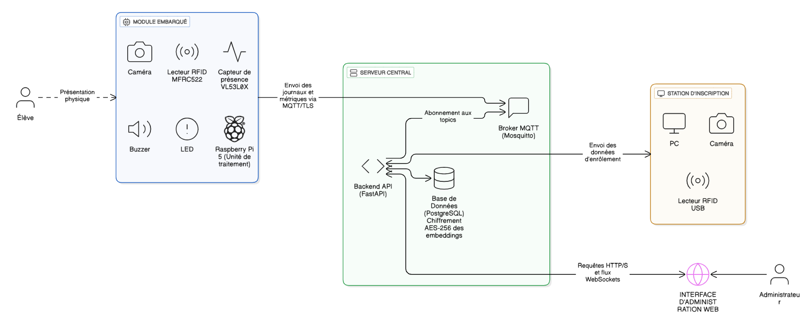
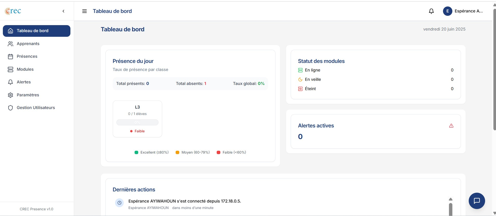
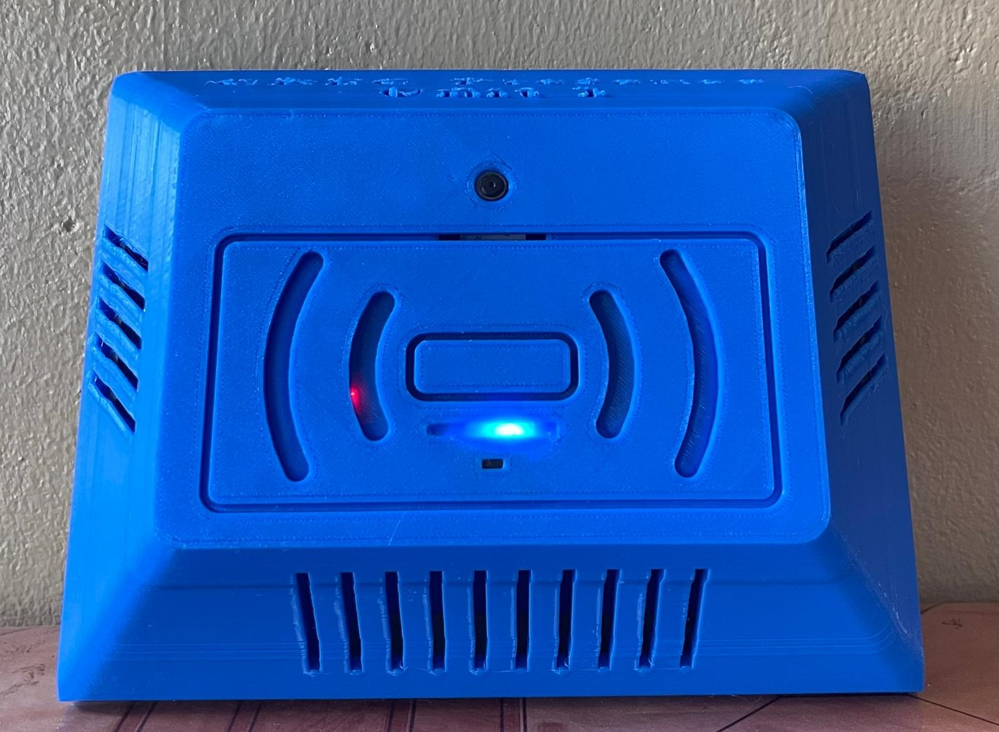

# Edge Attendance System

> **Offline-first biometric attendance that runs on-device (face + RFID), no cloud.**

[](https://www.python.org/)
[](https://fastapi.tiangolo.com/)
[](https://react.dev/)
[](https://www.raspberrypi.com/)
[](LICENSE)
[](https://github.com/TitanSage02/Edge-Attendance-System/actions/workflows/ci.yml)

Built as my BSc Computer Science thesis (graded **18/20**), originally *"CREC Presence"*, piloted at **CREC, Benin**.

## Why it exists

Most AI assumes the cloud is one request away, the network never drops, and power is constant. For much of the world, none of that holds. **Edge Attendance System was built for the opposite case** — a system that keeps working when connectivity is intermittent, GPUs are unavailable, and the grid cuts out. It was designed and piloted in Benin, where these constraints are the norm rather than the exception, which makes them the most demanding testbed for edge AI: what runs reliably here runs anywhere. The goal is a blueprint for **on-device intelligence under real-world constraints** — starting in Africa, applicable worldwide.

---

## What it is

Edge Attendance System is an **AIoT** attendance platform that performs biometric recognition **directly on the device** — a Raspberry Pi 4 running [InsightFace](https://github.com/deepinsight/insightface) for face recognition and [ChromaDB](https://www.trychroma.com/) for on-device vector search. Each unit pairs **face recognition with an RFID card** for two-factor identification, works **fully offline**, and **defers synchronization** to a central server over MQTT/TLS when connectivity returns. Biometric templates never leave the device unencrypted: embeddings are protected with AES-256 and raw face images are deleted after enrollment.

## Architecture



The system has three tiers:

- **Edge attendance unit** (Raspberry Pi 4) — captures face + RFID, runs inference locally, stores presence events in a local queue, and publishes them upstream when online. Survives network outages.
- **Server** — a FastAPI backend (PostgreSQL, MQTT broker, optional RAG chatbot) and a React/TypeScript dashboard for enrollment, monitoring, and reporting.
- **Enrollment scanner** — a low-cost ESP32 + MFRC522 station that reads RFID card UIDs during student enrollment.

Sensor → edge inference → MQTT/TLS → server. See [docs/ARCHITECTURE.md](docs/ARCHITECTURE.md) for the full data flow.

## In action

| Admin dashboard | Attendance unit (3D-printed) |
|---|---|
|  |  |

Real-time module monitoring, attendance analytics and exports (left); the on-device dual-authentication unit — Raspberry Pi 4, camera, RFID reader and ToF sensor in a custom 3D-printed enclosure (right).

## Key features

- 🧠 **On-device inference** — face embeddings computed on the Pi 4; no images or biometrics sent to the cloud.
- 📴 **Offline-first** — presence events are queued locally and synced via MQTT once connectivity is restored.
- 🔐 **Two-factor identification** — face recognition **and** RFID card, reducing spoofing and false matches.
- 🛡️ **Privacy by design** — AES-256 encryption of embeddings, raw images deleted after enrollment.
- 🔌 **Low power** — runs on battery; measured ~2h46 of autonomy on the pilot unit.
- 📊 **Web dashboard** — real-time module status, attendance analytics and exports, plus an **optional** RAG assistant (the only component that may call an external LLM; fully detachable).

## Results / metrics

Measured during the field pilot at CREC:

| Metric | Value |
|---|---|
| Recognition accuracy | **88.3%** |
| False Acceptance Rate (FAR) | **2.1%** |
| False Rejection Rate (FRR) | **5.6%** |
| End-to-end latency | **~3.7 s** |
| Battery autonomy | **~2h46** |

> Figures reflect a real-world pilot deployment, not a controlled benchmark. See [Limitations](#limitations--future-work).

## Tech stack

| Layer | Technologies |
|---|---|
| **Embedded** | ESP32, MFRC522 RFID, 16×2 I²C LCD, KiCad (PCB), 3D-printed enclosures |
| **Edge ML** | Raspberry Pi 4, InsightFace (`buffalo_l`), ONNX Runtime, OpenCV, ChromaDB, VL53L0X ToF sensor, RPi.GPIO |
| **Backend** | Python 3.10, FastAPI, SQLAlchemy/SQLModel, PostgreSQL, Pydantic, structlog |
| **Frontend** | React 18, TypeScript, Vite, Tailwind CSS, shadcn/ui, TanStack Query |
| **Infra** | MQTT (Mosquitto) over TLS, Docker / Docker Compose, Nginx/Caddy, Cloudflare Tunnel |
| **AI assistant** *(optional)* | Detachable RAG module over system logs (ChromaDB); pluggable LLM backend |

## Repository structure

```
edge-attendance-system/
├── firmware-enrollment/     # ESP32 + MFRC522 RFID enrollment scanner (firmware + KiCad PCB + 3D models)
├── edge-attendance-unit/    # Raspberry Pi 4 attendance unit (face + RFID, offline-first, MQTT client)
│   ├── sensors/             # camera, RFID, distance sensor, LED/buzzer feedback
│   ├── auth/                # face + RFID authentication logic
│   ├── communication/       # MQTT manager (TLS, offline buffering)
│   ├── config_web/          # local Flask config portal for the unit
│   ├── tests/               # pytest suite
│   └── .env.example         # config template (copy to .env — never commit secrets)
├── server/
│   ├── backend/             # FastAPI: API, MQTT service, face enrollment, RAG chatbot
│   └── frontend/            # React + TypeScript admin dashboard
├── docs/                    # architecture, hardware, deployment, security docs + images
├── .github/workflows/       # CI: secret scan (gitleaks), Python byte-compile, edge tests, frontend build
├── .pre-commit-config.yaml  # gitleaks + detect-private-key + large-file guard
├── README.md
├── LICENSE
└── .gitignore
```

## Getting started

### Prerequisites

- **Edge unit:** Raspberry Pi 4 (Raspberry Pi OS, 64-bit), Python 3.10, a CSI/USB camera, MFRC522 RFID reader, VL53L0X distance sensor.
- **Server:** Docker + Docker Compose (recommended), or Python 3.10 + PostgreSQL for a manual run; Node.js 18+ for the frontend.
- **Enrollment scanner:** ESP32 dev board, MFRC522, 16×2 I²C LCD; Arduino IDE or PlatformIO.

Each component is configured through a `.env` file. **Never commit real `.env` files** — copy the provided `.env.example` and fill in your own values.

### 1. Server (backend + frontend)

```bash
cd server/backend
cp .env.example .env          # then edit with real values (see SECURITY.md)
docker compose -f docker-compose.dev.yml up --build
```

```bash
cd server/frontend
cp .env.example .env
npm install
npm run dev
```

### 2. Edge attendance unit (Raspberry Pi)

```bash
cd edge-attendance-unit
cp .env.example .env          # set BASE_URL, API_KEY, MQTT credentials
pip install -r requirements.txt
python startup.py
```

> **Face recognition models:** the InsightFace `buffalo_l` model (~280 MB unpacked) is **not committed**. It is downloaded automatically on first run by InsightFace into the model path. No manual step is required as long as the device has internet access for the initial download.

### 3. Enrollment scanner (ESP32)

Open `firmware-enrollment/firmware/` in the Arduino IDE / PlatformIO, set your Wi-Fi and board settings, and flash. See [firmware-enrollment/README.md](firmware-enrollment/README.md) and [docs/HARDWARE.md](docs/HARDWARE.md).

## Documentation

- [Architecture](docs/ARCHITECTURE.md) — tiers, data flow, MQTT topics, offline-first behavior
- [Hardware](docs/HARDWARE.md) — components, GPIO mapping, PCB (KiCad), 3D enclosures
- [Deployment](docs/DEPLOYMENT.md) — Docker Compose, MQTT/TLS, systemd edge service
- [Security](docs/SECURITY.md) — threat model, key management, encryption

## Limitations & future work

- **Lighting sensitivity** — accuracy degrades under poor or uneven lighting; controlled lighting improves results.
- **No liveness detection** — the current pipeline does not detect presentation attacks (photos/video). RFID two-factor mitigates but does not eliminate this. Liveness detection is planned future work.
- **Pilot-scale dataset** — metrics come from a small pilot cohort; larger and more diverse data is needed to generalize.
- **Single-model recognition** — one embedding model (`buffalo_l`); ensembling or fine-tuning on local faces could improve FAR/FRR.
- **Battery life** — ~2h46 autonomy limits all-day untethered use; power optimization and a larger battery are on the roadmap.

## Privacy & ethics

This system processes biometric data and was designed **privacy-first**:

- Face **embeddings are encrypted at rest with AES-256**; raw face images are **deleted after enrollment**.
- Inference happens **on-device** — biometric data is not sent to any cloud service.
- Synchronization to the server carries only presence events and encrypted templates, over **MQTT/TLS**.

If you deploy this system, you are responsible for obtaining informed consent and complying with applicable data-protection regulations. See [docs/SECURITY.md](docs/SECURITY.md).

## License

Released under the [MIT License](LICENSE).

---

*Built by Espérance AYIWAHOUN as a BSc Computer Science thesis (graded 18/20), originally "CREC Presence", piloted at CREC, Benin.*
