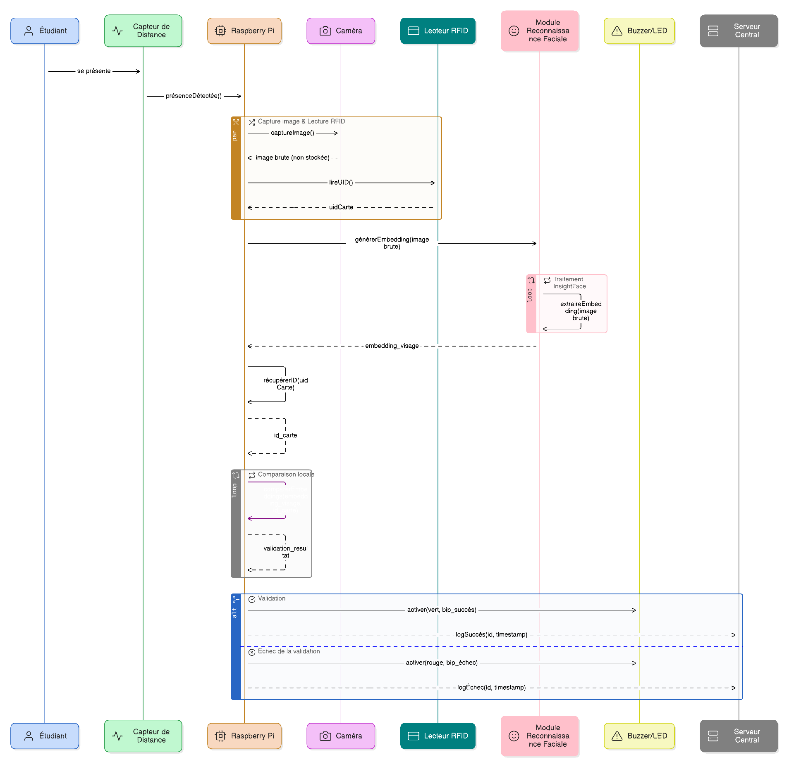
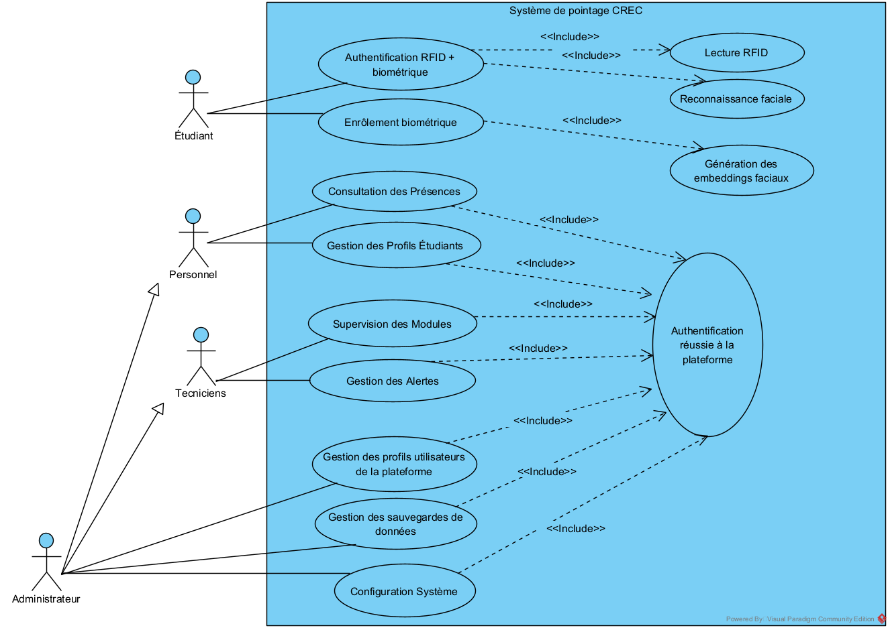
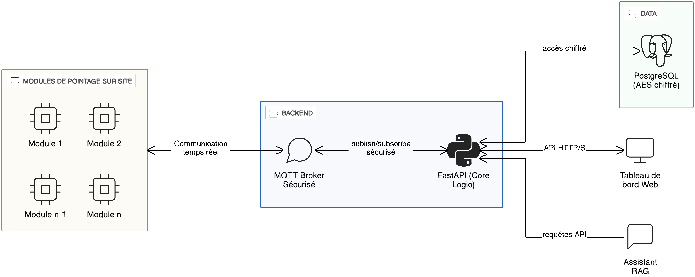

# Architecture

Edge Attendance System is an offline-first AIoT platform. Biometric inference happens **on the edge device**; the server only receives presence events and encrypted templates.


## Tiers

1. **Enrollment scanner** (ESP32 + MFRC522) — reads an RFID card UID during enrollment; the operator binds it to a student in the dashboard.
2. **Edge attendance unit** (Raspberry Pi 4) — captures face + RFID, runs InsightFace inference locally, matches against an on-device ChromaDB vector store, and records presence. Works offline.
3. **Server** — FastAPI backend (PostgreSQL + MQTT broker + optional RAG chatbot) and a React dashboard.

## Data flow

```
[RFID card] ──► ESP32 scanner ──► (operator enters UID) ──► Dashboard ──► Backend ──► PostgreSQL
                                                                              │
                                                              face enrollment │ (AES-256 embeddings)
                                                                              ▼
[Student] ──► VL53L0X wake ──► Pi camera ──► InsightFace embedding ──► ChromaDB match (on-device)
                                                                              │
                                                          presence event      ▼
                                          MQTT/TLS  ◄──────────────────  Edge unit (queued if offline)
                                              │
                                              ▼
                                    Mosquitto broker ──► Backend MQTT service ──► PostgreSQL
                                                                              │
                                                          WebSocket push      ▼
                                                                        React dashboard (real-time)
```

## Authentication sequence

Two-factor identification combines a face match and an RFID card before a presence event is accepted.



## Use cases



## Offline-first behavior

- Presence events are written to a **local queue** on the edge unit.
- The MQTT manager buffers messages while disconnected and **replays** them on reconnect (see `edge-attendance-unit/communication/mqtt_manager.py`).
- The unit keeps recognizing faces fully offline using the local ChromaDB store; no server round-trip is needed for a match.

## MQTT topics

| Topic | Direction | Purpose |
|---|---|---|
| `crec/modules/config_updates` | server → units | configuration broadcast |
| `crec/modules/{module_uid}/status` | unit → server | health / heartbeat |
| `crec/modules/{module_uid}/presence` | unit → server | presence events |
| `crec/modules/{module_uid}/logs` | unit → server | structured logs |
| `crec/modules/{module_uid}/command` | server → unit | remote commands |

> Topic names and the `crec-presence.service` identifier are intentionally preserved from the pilot deployment.

## Platform overview


