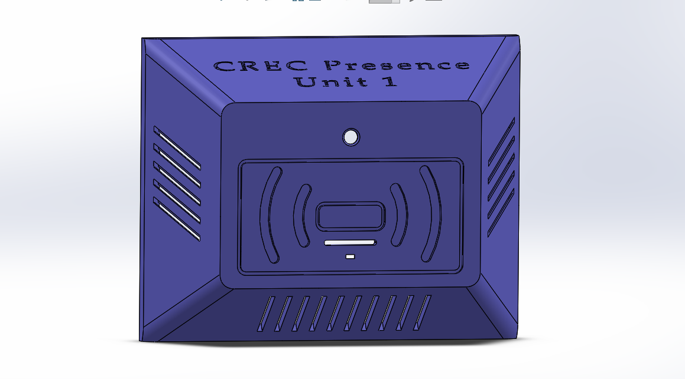
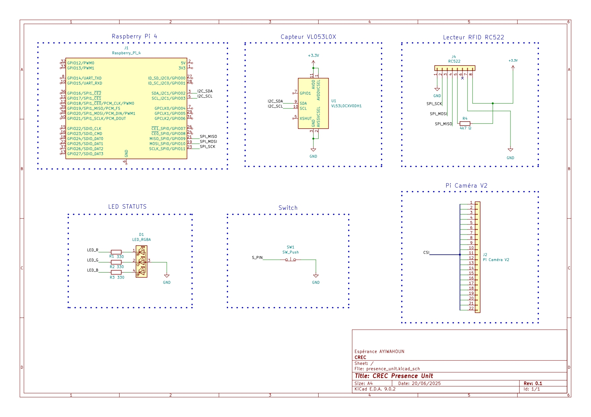
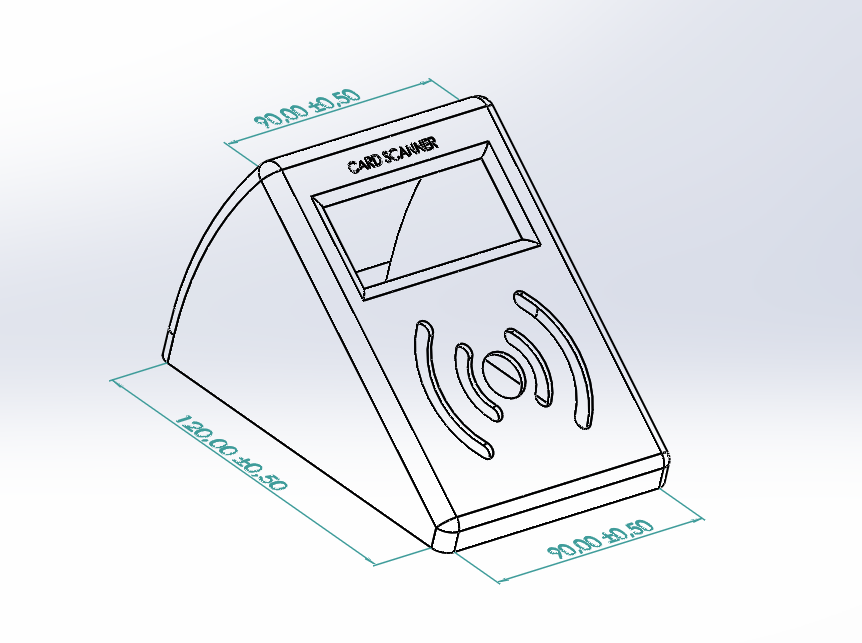
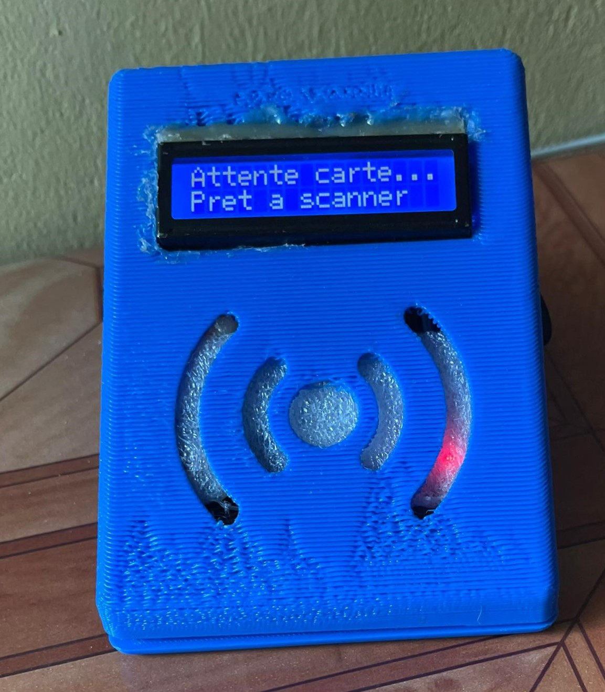

# Hardware

Two custom hardware units: the **RFID enrollment scanner** (ESP32) and the **edge attendance unit** (Raspberry Pi 4).

## Edge attendance unit (Raspberry Pi 4)

| Component | Interface | Purpose |
|---|---|---|
| Raspberry Pi 4 (4 GB) | — | runs on-device inference |
| Pi Camera v2 / USB camera | CSI / USB | face capture |
| MFRC522 RFID reader | SPI | card identification |
| VL53L0X ToF sensor | I²C | presence detection / camera wake |
| RGB status LEDs | GPIO | visual feedback |
| Piezo buzzer | GPIO | audible feedback |

Default GPIO pin mapping is defined in `edge-attendance-unit/.env.example` (red 18, green 16, blue 15, buzzer 12, RFID 22).

**3D model / print:**

Wiring schematic: 

## RFID enrollment scanner (ESP32)

| Component | Interface | Pins (ESP32 GPIO) |
|---|---|---|
| ESP32 DevKit | — | main MCU (Wi-Fi/BT disabled in firmware) |
| MFRC522 (13.56 MHz) | SPI | SS 5, SCK 18, MOSI 23, MISO 19, RST 22 |
| 16×2 LCD (PCF8574) | I²C | SDA 21, SCL 22 (`0x27`) |
| Status LED | GPIO | 6 |
| Buzzer | GPIO | 4 |

**Power:** USB 5 V, ≤ 500 mA (PC or power bank). Peak measured draw ~310 mA.

**PCB (KiCad):** sources in [`firmware-enrollment/rfid_reader/`](../firmware-enrollment/rfid_reader/) — `rfid_reader.kicad_pro`, `.kicad_sch`, `.kicad_pcb`. Exported schematic: [`firmware-enrollment/card_scanner_sch.pdf`](../firmware-enrollment/card_scanner_sch.pdf).

**3D model / print:**

## Suggested hardware improvements

From pilot findings (documented in the thesis):

- Resettable polyfuse (500 mA) + TVS diodes for electrical protection.
- 100 nF decoupling caps at the ESP32 and MFRC522, plus 10 µF bulk caps for supply stability.
- ASA enclosure for outdoor durability.
- Firmware light-sleep (< 20 mA) after 1 s idle; OTA update support.
